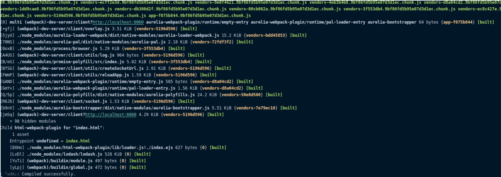
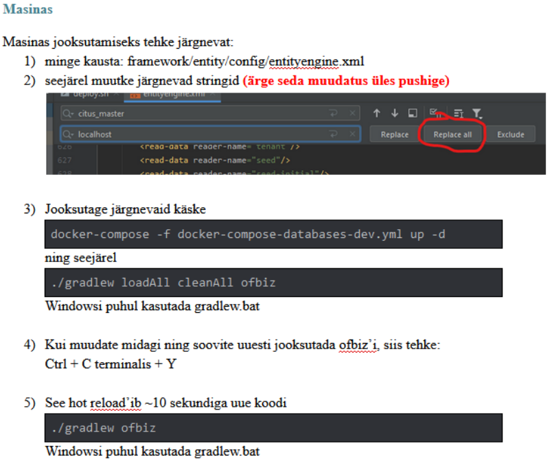

#Manufacturing Warehouse team README

##Ofbizi tööle panemine

###Linuxis

####Back

```bash
git clone https://github.com/tutinformatics/ofbiz.git
docker-compose -f docker-compose-databases-dev.yml up -d
sudo ./gradlew loadAll cleanAll ofbiz
```
or try
```bash
sudo ./gradlew ofbiz
```
Kui tööle hakkas siis terminalis peaks selline sisu olema:


####Front
```bash
git clone https://github.com/tutinformatics/accounting_ui.git
docker-compose up
```

Kui tööle hakkas siis terminalis peaks selline sisu olema:


Ava uus terminal ja sinna sisesta:

```bash
au run 
```
või
```bash
npm start
```

Kui tööle hakkas siis terminalis peaks selline sisu olema:



Netibrauseris mine lehele: localhost:80

###Windows

####Back
Terminalis:
```bash
cd
cd ..
cd ..
cd nginx-1.17.10
start nginx
```

Ofbizi repos:
```bash
gradlew.bat ofbiz
```

####Front
Accounting UI repos:
```bash
docker-machine start default
docker-compose up
```
ja siis
```bash
au run
```
või
```bash
npm start
```

##Lahendused probleemidele
###Postgresql
####S1


```bash
docker-compose -f docker-compose-databases-dev.yml up -d
./gradlew loadAll cleanAll ofbiz
```

####S2
```bash
sudo lsof -i -P -n | grep 5432
```
Should be empty, if not:
```bash
sudo service postgresql stop
```

####S3
```bash
sudo lsof -i -P -n | grep 4567
```
Should be empty, if not:

check running docker containers: 
```bash
docker ps
```
kill all: 
```bash
docker stop $(docker ps -a -q)
```

###javaCompile
####S1

```bash
docker-compose -f docker-compose-databases-dev.yml up -d
sudo ./gradlew loadAll ofbiz
```

###Docker-compose
####S1

```bash
docker rm citus_manager
```

####S2


See postgresql Solution 2

####S3

```bash
sudo service nginx stop
```

####S4

```bash
docker stop proxy-dev
docker rm proxy-dev
```